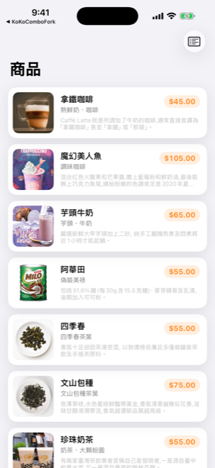
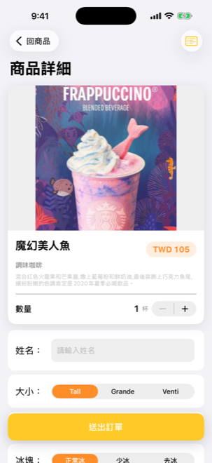
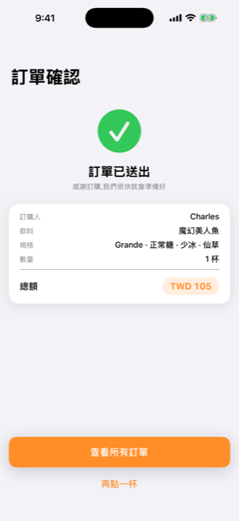
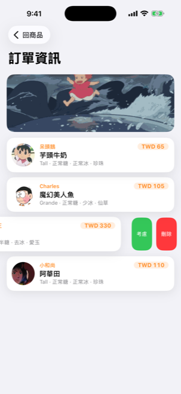
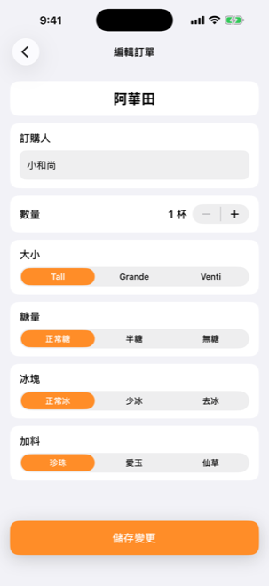

# NewOrderOoO

NewOrderOoO（home screen 顯示名稱：**沏光**）是一個 iOS 飲料訂購 demo app，使用 Swift / UIKit 實作，搭配 Firebase Anonymous Auth 與 Cloud Firestore 儲存訂單資料。專案重點是把早期 storyboard 型 app 整理成較清楚的 MVVM + Repository 架構，並補上卡片式 UI、訂單確認頁、編輯訂單與基礎單元測試。

## Portfolio Notice

這個 repository 是個人履歷與作品集展示用。**原始碼**以 MIT 授權釋出 (見 [LICENSE](LICENSE))；**圖片、GIF、App Icon 等素材**保留所有權利,不授權第三方重用。隱私說明見 [PRIVACY.md](PRIVACY.md),第三方授權見 [THIRD_PARTY_LICENSES.md](THIRD_PARTY_LICENSES.md)。

Repo 不包含真實 Firebase 設定檔。clone 後即使沒有 `GoogleService-Info.plist` 也可以 build 並開啟 app 查看商品列表與 UI；下單、訂單列表、編輯與刪除等 Firebase 功能需要自行建立 Firebase project,並在本機加入 `NewOrderOoO/GoogleService-Info.plist` (可從 `GoogleService-Info.example.plist` 複製改名後填入自己的值)。

## 功能

- 商品列表：顯示 12 款飲料、商品圖片、品名、描述與價格。
- 商品詳細：選擇大小、糖量、冰塊、加料與數量，並即時計算總額。
- 送出訂單：驗證訂購人姓名後寫入 Firestore，成功後顯示收據頁並排程本地推播。
- 訂單列表：讀取目前匿名使用者的訂單，支援空狀態、載入狀態與錯誤重試。
- 訂單管理：左滑刪除訂單，點擊訂單可編輯訂購人與規格。
- 使用者隔離：透過 Firebase Anonymous Auth 取得 uid，Firestore 規則限制只能讀寫自己的訂單。
- UI 系統：集中管理色彩、字型、圓角、陰影與 reusable status overlay。

## 畫面

截圖來自 iPhone 17 Pro Max 模擬器。

| 商品列表 | 商品詳細 / 選規格 | 送出訂單 |
| :---: | :---: | :---: |
|  |  |  |
| 顯示 12 款飲料，含商品圖、品名與價格。 | 大小 / 糖量 / 冰塊 / 加料 / 數量，即時算總額。 | 訂單寫入 Firestore + 排程本地推播。 |

| 訂單列表 | 取消（左滑刪除） | 編輯訂單 |
| :---: | :---: | :---: |
|  |  |  |
| 讀取目前 uid 的訂單，搭配 hero card。 | 左滑顯示「考慮 / 刪除」動作。 | 修改訂購人 / 杯數 / 規格後存回 Firestore，總額用 unitPrice × quantity 重算。 |

## 技術棧

- Swift 5.9+
- UIKit
- Storyboard + programmatic UI
- async/await
- Firebase iOS SDK 11.x
  - FirebaseAuth
  - FirebaseFirestore
- Swift Package Manager
- XCTest
- iOS 14.5+

## 專案結構

```text
NewOrderOoO/
├── AppDelegate.swift
├── SceneDelegate.swift
├── Base.lproj/
│   ├── Main.storyboard
│   └── LaunchScreen.storyboard
├── DomainModels.swift
├── ProductData.swift
├── OrderData.swift
├── OrderRepository.swift
├── ViewModels.swift
├── AppTheme.swift
├── StatusOverlayView.swift
├── MenuTableViewController.swift
├── MenuDetailTableViewController.swift
├── OrderDetailTableViewController.swift
├── ReceiptViewController.swift
├── EditOrderViewController.swift
└── Assets.xcassets/

NewOrderOoOTests/
├── MoneyTests.swift
├── MenuDetailViewModelTests.swift
├── OrderListViewModelTests.swift
└── MockOrderRepository.swift

firestore.rules
```

## 架構

```text
ViewController
    ↓
ViewModel
    ↓
OrderRepository protocol
    ↓
FirestoreOrderRepository
    ↓
Firebase Firestore
```

主要職責：

- `DomainModels.swift`：金額模型 `Money`、飲料規格 enum、`OrderInput`、靜態商品目錄。
- `ViewModels.swift`：商品列表、下單與訂單列表的業務邏輯。
- `OrderRepository.swift`：封裝 Firestore CRUD 與 Anonymous Auth uid 注入。
- `AppTheme.swift`：集中管理 UI theme。
- `StatusOverlayView.swift`：載入、空資料與錯誤狀態。
- `ReceiptViewController.swift`：下單成功摘要頁。
- `EditOrderViewController.swift`：編輯既有訂單。

## Design patterns

- **MVVM + Repository**：VC 純 UI，VM 收業務邏輯，`OrderRepository` protocol 隔開 Firestore 細節。
- **Strong-typed value objects**：`Money`（Decimal）、`OrderInput`，避免浮點誤差與參數混淆。
- **Enum 取代 server 字串**：`DrinkSize` / `SugarLevel` / `IceLevel` / `AddOn`，compile-time 防拼字錯誤。
- **Protocol-oriented DI**：`OrderRepository` 注入 ViewModel，測試換 `MockOrderRepository`。
- **設計 token 集中**：`AppTheme`（色 / 字 / 圓角 / 陰影）。
- **Reusable state view**：`StatusOverlayView` 統一載入 / 空 / 錯誤三種狀態。
- **Per-user 資料隔離**：Firestore 文件帶 `uid` 欄位 + Security Rules 強制 owner-only。

> 詳細選型理由與被放棄的方案見 [DECISIONS.md](DECISIONS.md)。

## Firestore 資料

Collection：`orderList`

| 欄位 | 型別 | 說明 |
| --- | --- | --- |
| `uid` | string | 訂單擁有者的 Firebase Auth uid |
| `orderName` | string | 訂購人姓名 |
| `drinkName` | string | 飲料名稱 |
| `drinkSize` | string | `Tall` / `Grande` / `Venti` |
| `sugar` | string | `正常糖` / `半糖` / `無糖` |
| `cold` | string | `正常冰` / `少冰` / `去冰` |
| `add` | string | `珍珠` / `愛玉` / `仙草` |
| `quantity` | number | 杯數（後加欄位，舊文件可能沒有，編輯時 fallback 為 1） |
| `unitPrice` | string | 單杯價格，例如 `TWD 45`（後加欄位，舊文件可能沒有，編輯時從 `ProductCatalog` 反查） |
| `price` | string | 訂單總額（= `unitPrice × quantity`），例如 `TWD 90` |

## Firebase 設定

1. 建立 Firebase project。
2. 在 Firebase Console 啟用 Authentication 的 Anonymous sign-in。
3. 下載 `GoogleService-Info.plist`，放到 `NewOrderOoO/` 目錄。這個檔案包含本機 Firebase 專案設定，已列入 `.gitignore`，不要 commit 到 repo。build 時專案會自動把本機 plist 複製進 app bundle。
4. 部署 Firestore rules：

```bash
firebase deploy --only firestore:rules
```

Security rules 重點：

- 建立訂單時，`request.resource.data.uid` 必須等於 `request.auth.uid`。
- 讀取、更新、刪除訂單時，文件的 `uid` 必須等於目前登入者。

## 開發方式

```bash
git clone https://github.com/cowton0627/NewOrderOoO.git
cd NewOrderOoO
open NewOrderOoO.xcodeproj
```

在 Xcode 選擇 iPhone 模擬器後執行。

第一次開啟專案時，Xcode 會透過 Swift Package Manager 解析 Firebase 相關套件。

## 測試

目前測試集中在 domain 與 ViewModel 層：

- `MoneyTests`
- `MenuDetailViewModelTests`
- `OrderListViewModelTests`

可在 Xcode 使用 `Cmd + U` 執行測試。

## 已知限制

- 商品資料目前寫死在 `ProductCatalog`，尚未改成從 Firestore 載入。
- Anonymous Auth 適合 demo；正式產品應支援 Apple / Google 登入與帳號資料轉移。
- 舊資料 migration helper 已從預設載入流程移除，避免公開 demo 接管其他使用者資料。

## Roadmap

- 購物車：一次送出多杯不同規格。
- 訂單狀態：待製作、製作中、完成、取消。
- 商品搜尋與分類。
- 產品資料動態化。
- 遠端推播 (FCM)：訂單狀態變化時主動通知（目前只有送單成功本地推播）。
- Crashlytics / Analytics。
- CI/CD。
- UI test 與 Firestore emulator 整合測試。

## 授權與隱私

- 程式碼授權:[LICENSE](LICENSE) (MIT)
- 素材 (圖片 / GIF / App Icon):保留所有權利,不授權重用
- 隱私說明:[PRIVACY.md](PRIVACY.md)
- 第三方套件授權:[THIRD_PARTY_LICENSES.md](THIRD_PARTY_LICENSES.md)
